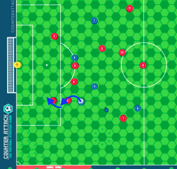

[Read this page in English](https://counterattackgame.github.io/wiki/movement_phase) - [Lire cette page en Français](https://counterattackgame.github.io/wiki/fr/movement_phase) - [Leggi questa pagina in Italiano](https://counterattackgame.github.io/wiki/it/movement_phase) - [Lê esta página em Português](https://counterattackgame.github.io/wiki/pt/movement_phase) - [Διαβάστε αυτή τη σελίδα στα Ελληνικά](https://counterattackgame.github.io/wiki/gr/movement_phase)

[Back to Home Page](https://counterattackgame.github.io/wiki/fr/index)
# Phase de mouvement

Une phase de mouvement correspond aux déplacements simultanés des joueurs sur le terrain. L’équipe en attaque peut démarrer une phase de mouvement après n’importe quelle action, sauf une passe haute. Plusieurs phases de mouvement peuvent se succéder.
Chaque joueur a une caractéristique de vitesse (Pace) qui détermine la distance qu’il peut parcourir en une phase de mouvement. Par exemple, un joueur ayant une vitesse de 6 pourra se déplacer de 6 cases pendant une phase de mouvement. Les joueurs ne peuvent pas traverser de cases occupées par d’autres joueurs (sauf un petit pont - voir plus bas).

La phase de mouvement suit une séquence « 4 – 5 – 2 » : 
1. L’équipe en attaque déplace 4 joueurs (dont le gardien, si nécessaire)
2. L’équipe en défense déplace 5 joueurs (idem)
3. L’équipe en attaque déplace 2 autres joueurs de 2 cases maximum (idem).  

Pendant la phase de mouvement, si un joueur en possession du ballon passe par une case voisine d’un joueur adverse, celui-ci DOIT essayer d’intercepter le ballon. Pour récupérer le ballon, le joueur en défense doit obtenir un 6 au dé, ou un score combiné (tacle + dé) supérieur ou égal à 10. S’il y parvient, le joueur en attaque cesse immédiatement son déplacement et le jeu continue par "Tout autre scénario" (Any other scenario). En cas d’échec de l’interception, le porteur de balle peut continuer son mouvement dans la zone d’influence du joueur concerné sans que celui-ci puisse tenter à nouveau l’interception.

Si le joueur en défense qui tente l’interception fait 1 au dé, il commet une faute (voir plus bas).

**Actions possibles pendant la phase de mouvement**

- Il n’est pas possible de faire une [passe](https://counterattackgame.github.io/wiki/fr/passing) avant la fin de la phase de mouvement. Néanmoins, il est possible de tirer durant la phase de mouvement si le porteur de balle entre dans la surface de réparation (tir instantané - [Snapshot](https://counterattackgame.github.io/wiki/fr/shooting).
- Si un défenseur se déplace sur une case voisine du porteur de balle, il peut tenter un tacle. Mettez en pause le sablier le temps du tacle.
- Lorsqu’un tacle est réussi pendant la phase de mouvement, la possession du ballon change et la phase de mouvement en cours prend fin immédiatement..

## Tacle et dribble

Un tacle est un duel entre le joueur en défense et le porteur de balle. Un tacle peut être tenté si le joueur de l’équipe en défense se déplace sur une case voisine du porteur de balle pendant la phase de mouvement. Lancez le dé et additionnez les résultats respectifs à la caractéristique dribble du porteur de balle et tacle du joueur de l’équipe en défense

S’il y a égalité, il faut suivre la règle du  [ballon libre](https://counterattackgame.github.io/wiki/fr/loose_ball). 
- si le ballon touche un joueur de l’équipe en attaque alors la phase de mouvement continue 
- si le ballon touche un joueur de l’équipe en défense ou est récupéré par un déplacement d’un joueur en défense, suivre “Tout autre scénario”
- si le joueur en défense fait 1 au dé, l’équipe en attaque peut jouer l’avantage ou demander la faute
- si le score combiné du porteur de balle est supérieur alors le tacle est raté. Le porteur de balle peut alors être repositionné sur n’importe quelle case autour du joueur en défense
- si le score combiné du joueur en défense est supérieur, le tacle est réussi et la possession change. Le joueur ayant réalisé le tacle peut être repositionné sur n’importe quelle case autour du joueur taclé.  La phase de mouvement s’arrête et l’équipe qui récupère le ballon choisit l’action suivante.

## Fautes

Si votre adversaire fait 1 sur une tentative de tacle ou d'interception dans les pieds, il commet une faute. Lancez le dé pour vérifier si votre joueur est blessé (voir ci-dessous). Vous avez deux possibilités : jouer le coup-franc ou le penalty, ou continuer à jouer (avantage).

Même si vous choisissez de continuer à jouer, vous devez lancer les dés pour déterminer si le joueur est blessé et si le joueur adverse est averti par l’arbitre. Si vous décidez de stopper le jeu pour tirer un coup-franc/pénalty, alors référez-vous à la partie « coups de pied arrêtés ».

## Blessures

L’équipe en attaque lance le dé. Le joueur est blessé si le résultat obtenu est supérieur ou égal à sa caractéristique Résilience. Placez alors un jeton blessure sur sa carte.
Un joueur blessé voit TOUTES ses caractéristiques réduites de 1 jusqu’à la fin du match. Vous avez la possibilité de le remplacer lors d’un arrêt de jeu (une bonne solution pour cela est de ne pas laisser l’avantage).
Les blessures ont **un effet immédiat**. Exemple : vous avancez d’une case, vous entrez dans la zone d’influence d’un joueur adverse, il commet une faute en tentant l’interception et blesse votre joueur. Si vous décidez de jouer l’avantage, le joueur est déjà blessé et pourra donc parcourir une case de moins.
Un joueur blessé pour la seconde fois dans le même match doit être immédiatement remplacé. L’attaquant sera donc obligé de stopper le jeu, remplacer son joueur et jouer un coup de pied arrêté.

## Carton jaune

L’équipe en défense lance le dé. Si le résultat est égal ou supérieur à la tolérance (Leniency) de l’arbitre, alors le joueur fautif reçoit un carton jaune. Un joueur qui reçoit un deuxième carton jaune est immédiatement exclu du terrain. Le jeu doit s’arrêter pour tirer un coup-franc ou un pénalty si un joueur reçoit un carton rouge.

## Tacle par derrière

Un résultat de 1 ou 2 au dé est considéré comme une faute si un défenseur tente un tacle par derrière. Un tacle est considéré par derrière s’il est tenté sur l'une des deux cases pour lesquelles le repositionnement du porteur de balle ne l'approcherait pas du but.

Un tacle par derrière est considéré comme dangereux et le joueur en défense qui le tente court le risque d’obtenir un carton rouge direct. S’il fait faute, lancez le dé.  

- Si le résultat est strictement inférieur à la tolérance (Leniency) de l’arbitre est obtenu alors le joueur reçoit un carton jaune
- Si le résultat est supérieur ou égal à la tolérance de l’arbitre, le joueur reçoit un carton rouge.

## Annihiler une occasion de but manifeste (“dernier défenseur”)

Si votre adversaire fait faute sur vous et annihile une occasion de but manifeste, il peut recevoir un carton rouge direct!

Si aucun autre défenseur ne peut s’interposer ou s’aligner dans la même phase de mouvement alors le défenseur ayant tenté le tacle sera considéré comme “dernier défenseur”.

Lancez le dé. Si le résultat du dé est supérieur ou égal à la tolérance de l'arbitre, votre joueur reçoit un carton rouge direct, sinon il ne reçoit qu'un carton jaune.

## Tacle assassin (Reckless tackle)

Parfois vous n'avez qu'une envie, découper votre adversaire ! Si vous souhaitez le faire, vous devez annoncer “TACLE ASSASSIN” (Reckless tackle) avant de lancer le dé. Dans ce cas, seule l’équipe en défense lance le dé.

- Si vous faites 1 ou 2, alors la tentative échoue et l’attaquant évite le tacle. Le jeu continue mais le défenseur reçoit un carton jaune pour avoir tenté un tacle assassin.
- Si vous faites 3 ou plus, votre adversaire est méchamment fauché ! Vérifiez la tolérance de l'arbitre. Si le résultat du dé est inférieur, vous recevez un carton jaune. S'il est supérieur, alors c'est un carton rouge bien mérité.
- 
Il n’est possible de tenter un tacle assassin que si le joueur ciblé est à 3 cases au maximum du ballon.

## Petit pont (Nutmeg)

Lorsque vous avez la balle et que vous souhaitez fixer un défenseur, vous pouvez tenter un petit pont.

C’est un mouvement difficile à effectuer mais qui vaut le coup en cas de réussite. Voici comment faire : 

1. Approchez-vous d’un joueur en défense pendant la phase de mouvement
2. Assurez-vous d’avoir assez de vitesse pour passer au travers du joueur adverse.
3. Vous lancez le dé comme pour un duel Dribble/Tacle classique
4. La caractéristique de tacle du joueur en défense est augmentée de 1
5. Le joueur en défense ne peut pas esquiver la tentative de petit pont et DOIT défendre

### What happens if the nutmeg is successful:

- The attacker moves to any hex on the other side of the defender. The defender is **stunned** and cannot move during the Movement Phase. 
- The attacker can move to one of the three hexes on the other side of the defender, and continue his move if he has any Pace remaining.

### What happens if the nutmeg is unsuccessful:

The defender wins the tackle and play continues in the usual manner, by repositioning around the attacker, who does not go through the defender.

If it’s a tie, refer to the [Loose Ball](https://counterattackgame.github.io/wiki/fr/loose_ball) instructions, but the attacker who initiated nutmeg cannot move - regardless of how much pace he has already used.

# Extra Notes
- Defender does not get to choose whether to Steal during the attacker's dribble, they DO have to roll, with the risk of unintentionally fouling.
- Same goes with the Nutmeg, the defender cannot just accept that it was successful, and its consequences, instead of taking part in a duel.
- Defending a steal or a nutmeg is NOT a choice. You have to defend.
- The attacker must call the attempt for a nutmeg when approaching the defender, so that the targeted defender does not get a steal attempt. Other closeby defenders get their chance for a steal, including the defenders whose ZOI the attacker lands after the successful nutmeg.
- When attempting a nutmeg you are using 2 Pace which needs to be available (one for the Defender's Hex and one for the Hex around them)
- A player or the ball can be placed on any hex visible (fully or partly) on the pitch. All those hexes are considered WITHIN bounds, so in order to have a throw-in, goal-kick and of course a goal, the ball has to move to a theoretical (non visible) adjacent hex towards the outer side of the board.
- When picking up a ball that was [loose](https://counterattackgame.github.io/wiki/fr/loose_ball), the movement ends immediately and resume with any other scenario. If you pick it up with the [Goalkeeper](https://counterattackgame.github.io/wiki/fr/goalkeeper) within the penalty box using your hands, and continue play as if you Saved and Held a shot.
- As soon as the attacker steps into the box with the ball, the GK has to move the allowed 1 hex. The attacker then continues their move, if pace allows.
- If an attacker with the ball enters, leaves and reenters the penalty box in one Movement Phase, the GK gets a free move every time that attacker enters the box.
- When trying to collect an unclaimed ball, there is a ZOI of defenders. If the ball is not in possession, if a defender goes within one Hex to it (even the Goalkeeper), he can roll as if he was trying a steal.
- This can only be done by the defence, and if successful, player attracts the ball, Movement Phase ends immediately and play continues as a successful steal: “Any other Scenario”

# Graphical Examples

## Movement Phase

Blue is in Possession and thus the "attacking team".
They attempt these 4 moves, B10 is acting risky there, by going into the R8 ZOI (twice, but R8 gets only once chance for a a steal, which let's say he fails), and then R4.
If R4 rolls a 6 (or a 10+ Tackling) the ball is stolen, Movement Phase comes to an end as possession (and thus "attacking team") change. R4 does not reposition ,And Play continues with "Any Other Scenario"
If R4 rolls a 1, then a fouls is committed, Leniency and Resiliece tests are forced, and then Blue decide if they want to take the Free Kick or not. (See Set Pieces Section for more info on that)
Let's assume that R4 rolled a 3, so nothing happens.

## Defensive Movement Phase starts.
R4 tackles from where he stands, as he touches B10, but that is counted as a move for Red.
If Blue keeps possession after an unsuccessful tackle, B10 can reposition anywher around R4.
In case B10 ends within the Penalty Box after a reposition, the GK gets a free move of 1 Hex, but Blue cannot Snapshot, as it is thechnically in the Defensive Part of the Movement (blue is not dribbling into the box).

## Nutmeg during a Movement Phase

Blue is in Possession with 10, who has a Pace of 5 and Dribbling of 6. He is also Brazilian and decides to go for glory.
He has enough pace to attempt a nutmeg to R2, calls the nutmeg, wins the duel despite R2 got a tackling bonus of +1.
B10 is fully determined as the crowd is cheering. He calls annother nutmeg on R5, as he was just enough Pace to reach the other side of him. For the sake of the example he wins the duel fair and square, and calls a snapshot. But B10 rolls a 1 so shoots over the bar...but it was a world class move!

### Two points to consider here:
- Winning a Nutmeg practically allows a reposition, but it consumes 2 Paces whatsoever.
- If B10 had a Pace of 4, he could not have attempted the nutmeg on R5.

### Dribbling in and out of the Penalty Box

B10 wants to play it safe and avoid all possible steal attempts, so he follows the below path. He essentially enters the box twice, (in the two dark Hexes) so he should have stopped his movement twice to ask the keeper if they wanted to move their free Hex of 1.

[Back to Home Page](https://counterattackgame.github.io/wiki/fr/index)
