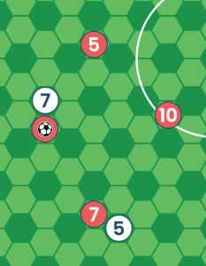
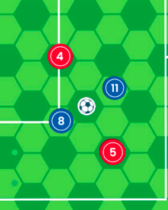
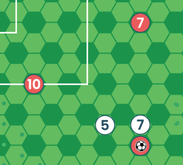
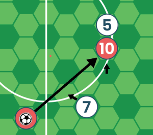

[Read this page in English](https://counterattackgame.github.io/wiki/passing)

[Lire cette page en Français](https://counterattackgame.github.io/wiki/fr/passing)

[Leggi questa pagina in Italiano](https://counterattackgame.github.io/wiki/it/passing)

[Lê esta página em Português](https://counterattackgame.github.io/wiki/pt/passing)

[Διαβάστε αυτή τη σελίδα στα Ελληνικά](https://counterattackgame.github.io/wiki/gr/passing)

[Πίσω στην Αρχική Σελίδα](https://counterattackgame.github.io/wiki/gr/index)
# Πάσες

Υπάρχουν 3 είδη Πάσας στους Βασικούς Κανόνες και ένα 4ο στους Προχωρημένους.

Οι ενδείξεις στους μετρητές απόστασης δείχνουν πόσο μακριά μπορούν να ταξιδέψουν οι πάσες σας. Αυτή είναι η μέγιστη επιτρεπτή απόσταση, οι πάσες σας μπορεί να είναι πιο κοντινές από τις ενδείξεις.

Κρατήστε το μετρητή απόστασης πάνω από τον παίκτη που έχει την κατοχή και στρέψτε τον προς την κατεύθυνση που θέλετε να στείλετε την πάσα.

## Βασική Πάσα

Η Βασική Πάσα ταξιδεύει πάνω στο γρασίδι (είναι συρτή). Η μπάλα δε μπορεί να διαπεράσει αντιπάλους (δείτε Ζώνη Επιρροής) αλλά μπορείτε να διαπεράσετε συμπαίκτες.

Αν η τροχιά της μπάλας έρθει εντός 1 Εξαγ΄βνου από αμυνόμενο, αυτός ο παίκτης μπορεί να ρίξει 6 ή αθροιστικό σκορ 10+ με την Ικανότητα Τάκλινγκ για να ανακόψει την πορεία της μπάλας.

Αν η διακοπή της πάσας είναι επιτυχής, η κατοχή της μπάλας αλλάζει, Συνεχίστε το παιχνίδι με "Οποιοδήποτε άλλο Σενάριο" (Φάση Κίνησης, Πάσα Πρώτου Χρόνου, Μακρινή Πάσα, Ξαφνικό Σουτ) Ο αμυνόμενος παίρνει τη μπάλα στο Εξάγωνό του, δεν πάει αυτός στη μπάλα, και δε μετακινείται με κάποιο τρόπο.

Ο παίκτης που κάνει μια Βασική Πάσα μπορεί να πάει να την πάρει αν το θέλει.

## Σέντρα

Χρησιμοποιήστε το μετρητή απόστασης για να δείτε μέχει πού μπορείτε να στείλετε τη Σέντρα σας. Αν υπάρχει αντίπαλος εντός 1 Εξαγώνου από τον παίκτη που κάνει τη Σέντρα και κατευθείαν στην επιθυμητή κατεύθυνση, η Σέντρα δεν είναι δυνατή. Τοποθετήστε τη μπάλα εκεί που θα θέλατε να καταλήξει. Η μπάλα πρέπει να στοχευθεί πάντα σε [Κεφάλι](https://counterattackgame.github.io/wiki/gr/heading) ενός εκ των συμπαικτών σας.

Έπειτα, κάθε ομάδα κινεί έναν παίκτη 3 Εξάγωνα καθώς η μπάλα κινείται. Αυτό σημαίνει ότι η θέσεις των παικτών ελε΄γχονται για Οφ-σάιντ πριν από αυτές τις 2 κινήσεις.

Αν η Σέντρα καταλήξει εντός Μεγάλης Περιοχής, ο Τερματοφύλακας μπορεί να κινηθεί 1 Εξάγωνο.

Τώρα, ελέγξτε την ακρίβειά της: Ικανότητα Σέντρα μαζί με τη Ζαριά πρέπει να είναι 8+. Αν η Σέντρα είναι ανακριβής, ανατρέξτε στην αντίστοιχη ενότητα παρακάτω.

Μια Σέντρα πρέπει να στοχευθεί τουλάχιστον 3 Εξάγωνα μακριά από τον παίκτη που την επιχειρεί, αλλά ακόμα και στο σενάριο που η Σέντρα είναι ανακριβής, δε μπορείτε να διεκδικήσετε με [Κεφαλιά](https://counterattackgame.github.io/wiki/gr/heading) την ίδια σας τη Σέντρα. Αν η Ανακριβής Σέντρα προσγειωθεί σε αυτόν που την επιχείρησε, συνεχίστε το παιχνίδι με "Οποιοδήποτε άλλο Σενάριο".

### Ανακριβείς Σέντρες

Αν μια Σέντρα είναι ανακριβής, ακολουθήστε τη ρουτίνα της [Διεκδικούμενης Μπάλας](https://counterattackgame.github.io/wiki/gr/loose_ball) για να βρείτε τον τελικό πραγματικό προορισμό της μπάλας. Αυτή η διαδικασία μπορεί να οδηγήσει το παιχνίδι σε Πλάγιο Άουτ, Άουτ, ή ΟφΣάιντ.

Σε περίπτωση ανακριβούς Σέντρας, η πορεία της μπάλας είναι μια ευθεία γραμμή από τον παίκτη που την επιχείρησε ως τον τελικό προορισμό.

Ανακριβείς Σέντρες δε μπορούν να ανακοπούν.

Όταν καθοριστεί ο τελικός προορισμός της μπάλας, αν υπάρχουν παίκτες εντός 2 Εξαγώνων, μια [Κεφαλιά](https://counterattackgame.github.io/wiki/gr/heading) ή προσπάθεια για κοντρολάρισμα πρέπει να γίνει από τουλάχιστον έναν παίκτη. Αν κανένας παίκτης δεν είναι εντός εμβέλειας, τότε ξεκινήστε μια [Φάση Κίνησης](https://counterattackgame.github.io/wiki/gr/movement_phase).

### Προσπάθεια για Κοντρόλ

Αν κανένας αντίπαλος δεν είναι αρκετά κοντά για να διεκδικήσει μια [Κεφαλιά](https://counterattackgame.github.io/wiki/gr/heading), μπορείτε να επιλέξετε να (α) πάρετε την κεφαλιά αμαρκάριστοι (βλ. [Κεφαλιά](https://counterattackgame.github.io/wiki/gr/heading)) ή (β) προσπαθήσετε να κοντρολάρετε τη μπάλα. Για τη δεύτερη επιλογή κάντε έναν έλεγχο με το ζάρι: Ικανότητα Ντρίμπλας + Ζαριά πρέπει να είναι 9+:

- Αν τα καταφέρετε, συνεχίστε το παιχνίδι σαν μόλις να κερδίσατε ένα τάκλινγκ.
- Αν ποτύχετε τρέξτε μια [Διεκδικούμενη Μπάλα](https://counterattackgame.github.io/wiki/gr/loose_ball) από τον παίκτη
- Αν κανένας δε μπορεί να διεκδικήσει μια ανακριβή Σέντρα, συνεχίστε το παιχνίδι με μια [Φάση Κίνησης](https://counterattackgame.github.io/wiki/gr/movement_phase). Η Επίθεση ξεκινά πρώτη.

## Μακρινή Πάσα

Μια Μακρινή Πάσα μπορεί να ταξιδέψει σε όποια θα θέση στο γήπεδο επιθυμούμε, το οποίο σημαίνει ότι δε χρειαζόμαστε το μετρητή απόστασης. Υπάρχουν όμως κάποιοι περιορισμοί!

- Δε μπορείτε να κάνετε μια Μακρινή Πάσα από το ένα Τελευταίο Τρίτο στο άλλο (Στους Προχωρημένους Κανόνες μπορείτε) ή να κάνετε μια Μακρινή Πάσα αν ένας αντίπαλος είναι σε διπλανό Εξάγωνο προς την κατεύθυνση που θα μπόκαρε την πορεία της μπάλας.

- Η μπάλα ΔΕΝ πρέπει να στοχευθεί εντός 5 Εξάγωνα απόσταση από οποιονδήποτε παίκτη σας και όχι ακριβώς δίπλα σε αμυνόμενο.

Δεν υπάρχει κανόνας που να απαγορεύει τον παίκτη που κάνει την Μακρινή Πάσα να την συλλέξει τελικά.

### Έλεγχος Ακρίβειας

Πρέπει να ελέγξετε την ακρίβεια όταν κάνετε μια Μακρινή Πάσα. Ένα Αθροιστικό Σκορ (Ζαριά + Ικανότητα Υψηλής Πάσας) 9+ χρειάζεται για να είναι η Μακρινή Πάσα ακριβής.

Στους προχωρημένους Κανόνες, μια Μακρινή πάσα από το ένα Τελευταίο Τρίτο στο άλλο είναι εφικτή, αλλά απαιτεί ένα αθροιστικό σκορ 10+ για να είναι ακριβής.

Αν η Πάσα είναι ανακριβής, ακολουθήστε διαδικασία [Διεκδικούμενης Μπάλας](https://counterattackgame.github.io/wiki/gr/loose_ball) όπως με τη Σέντρα.

Είτε ακριβής είτε όχι, η Μακρινή Πάσα ταξιδεύει ψηλά στον αέρα και δε μπορεί να ανακοπεί, στην πορεία της προς τον προορισμό της. Βέβαια, μια ανακριβής Μακρινή Πάσα μπορεί να προσγειωθεί σε έναν αντίπαλο. Πάντως η μπάλα προσγειώνεται στο έδαφος, ΔΕΝ εμπλέκεται διαδικασία κεφαλιάς.

### Τι κάνουμε μετά από μια Μακρινή Πάσα;

Μετά από τη μακρινή Πάσα, ο Αμυνόμενος προπονητής μπορεί να κινήσει τον τερματοφύλακά του με φάση την Ικανότητα Ταχύτητάς του. (μετά τον έλεγχο ακρίβειας)

Σε περίπτωση που η μπάλα μπει στη Μεγάλη Περιοχή, ο αμυνόμενος Τερματοφύλακας παίρνει και τη δωρεάν κίνηση του 1 Εξαγώνου.

Το παιχνίδι συνεχίζεται με μια [Φάση Κίνησης](https://counterattackgame.github.io/wiki/gr/movement_phase), με την επιτιθέμενη ομάδα να ξεκινά πρώτη.

## Πάσα Πρώτου Χρόνου

Οι Πάσες Πρώτου Χρόνου είναι κοντινές. Χρησιμοποιούνται για να ξεκλειδώσουν μια σφιχτή άμυνα, αλλά έχετε το νου σας γιατί ο αμυνόμενος μπορεί να κινηθεί για να την ανακόψει.

Αποφασίστε πού θα πάει η μπάλα και τότε κάθε ομάδα κινεί έναν παίκτη 1 Εξάγωνο καθώς η μπάλα ταξιδεύει. Η επιτιθέμενη ομάδα ξεκινά πρώτη.

- Αν ο αμυνόμενος αμυντικός κινηθεί ακριβώς πάνω στο μονοπάτι της πάσας, ανακόπτει την πάσα με ζαριά 5 ή 6 ή 10+ αθροιστικό με την ικανότητα Τάκλινγκ.
- Αν ο αμυνόμενος αμυντικός κινηθεί εντός 1 Εξαγώνου από το μονοπάτι της πάσας, ανακόπτει την πάσα με ζαριά 6 ή 10+ αθροιστικό με την ικανότητα Τάκλινγκ.
- Αν ο αμυνόμενος αμυντικός κινηθεί εντός 1 Εξαγώνου από τον παίκτη με την κατοχή της μπάλας, ρίχνει με 6 ή 10+ αθροιστικό με την ικανότητα Τάκλινγκ για να κλέψει. Ζαριά 1 είναι φάουλ.

Παρακαλώ σημειώστε ότι ο παραλήπτης της πάσας πρέπει να είναι διαφορετικός από τον πασέρ.

Επίσης σημειώστε ότι αν το 6ο Εξάγωνο μακριά στην Πάσα Πρώτου Χρόνου είναι ένας συμπαίκτης σας, και επιλέξετε να κινήσετε αυτόν τον παίκτη 1 Εξάγωνο, δε μπορεί να μεταφέρει τη μπάλα μαζί του. Ο περιορισμός απόστασης της Πάσας Πρώτου Χρόνο ισχύει.

# Γραφικά Παραδείγματα

## βασική Πάσα

Ο πάικτης με τη μπάλα είναι ο Κόκκινος 4 (Κ4).

- Μια πάσα δε μπορεί να πάει στο Κ5 γιατί περνάει ακριβώς διαμέσου του Λευκού 7
- Μια πάσα μπορεί να πάει στο Κ10 αλλά ο Λευκός 7 μπορεί να ρίξει ζάρι για να ανακόψει την πάσα, αφού η μπάλα περνάει μέσα από τη Ζώνη Επιρροής του
- Μια πάσα στο Κ7 μπορεί να παιχτεί χωρίς ανακοπές. Η μπάλα μπαίνει στη Ζώνη Επιρροής του Λευκού 5, αλλά εκείνο το Εξάγωνο καταλαμβάνεται από τον Κ7 άρα μια ανακοπή δεν είναι δυνατή.

Επίσης:

- Αν αυτή είναι μια Βασική Πάσα από Κόκκινο σε Κόκκινο, και οι 2 Μπλε ρίχνουν ζάρι για να ανακοψουν.
- Αν αυτή είναι μια Βασική Πάσα από Μπλε σε Μπλε, ΚΑΝΕΝΑΣ Κόκκινος δεν μπορεί να ανακόψει.

## Σέντρα

Ο πάικτης με τη μπάλα είναι ο Κόκκινος 4 (Κ4).

- Μια Σέντρα δε μπορεί να γίνει προς τον Κόκκινο 7 καθώς ο Λευκός 7 είναι στο ακριβώς δίπλα Εξάωνο και ευθέως πάνω στην κατεύθυνση της μπάλας.
- Μια Σέντρα μπορεί να γίνει προς την κατεύθυνση του Κόκκινου 10 διότι δεν υπάρχει αντίπαλος στο ακριβώς δίπλα Εξάγωνο.

## Μακρινή Πάσα

Οι Κανόνες μπλοκαρίσματος της Μακρινής Πάσας είναι ίδιοι με της Σέντρας.

## Πάσα Πρώτου Χρόνου

Ο πάικτης με τη μπάλα είναι ο Κόκκινος 4 (Κ4).

Μια πάσα πρώτου Χρόνου επιχειρείται στην κατεύθυνση του βέλους.

Όσο η μπάλα ταξιδεύει, ο Κόκκινος 10 κινείται για να υποδεχτεί τη μπάλα, και το Λευκό 7 για να προσπαθήσει να ανακόψει.

Επειδή ο Λευκός 7 κινείται πάνω στο μονοπάτι της πάσας, μπορεί να ανακόψει με 5 ή 6 ή αθροιστικό 10+ με την Ικανότητα Τάκλινγκ.

Αν ο Λευκός 7 αποτύχει, ο Κόκκινος 10 παίρνει τη μπάλα στο Εξάγωνο που κινήθηκε. Ο Λευκός 5 δεν έχει δυνατότητα ανακοπής, καθώς το Κόκκινος 10 καταλαμβάνει το Εξάγωνο που η μπάλα μπήκε στη Ζώνη Επιρροής του.

[Πίσω στην Αρχική Σελίδα](https://counterattackgame.github.io/wiki/gr/index)