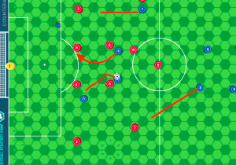
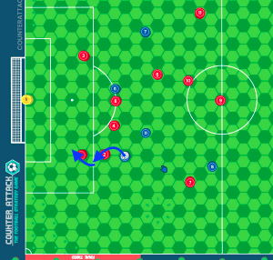
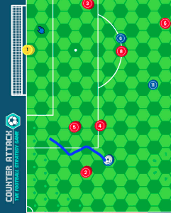

[Read this page in English](https://counterattackgame.github.io/wiki/movement_phase)

[Lire cette page en Français](https://counterattackgame.github.io/wiki/fr/movement_phase)

[Leggi questa pagina in Italiano](https://counterattackgame.github.io/wiki/it/movement_phase)

[Read this page in Portuguese](https://counterattackgame.github.io/wiki/pt/movement_phase)

[Ritorna all'Home Page](https://counterattackgame.github.io/wiki/it/index)
# Movement Phase

Una Movement Phase rappresenta una frazione di secondo sul campo. La squadra in attacco può iniziare una Movement Phase dopo qualsiasi tipo di azione ad eccezione di un High Pass. Una Movement Phase può seguire un'altra se l'allenatore vuole.

L'attributo Pace di ogni giocatore determina quanto lontano può spostarsi in una Movement Phase. Ad esempio, un giocatore con Pace 6 può muoversi massimo di 6 esagoni durante una Movement Phase. I giocatori non possono passare negli esagoni dove ci sono altri giocatori, sia compagni di squadra che avversari.

Durante una Movement Phase, si segue la sequenza 4-5-2:

1. La squadra che attacca muove 4 giocatori (può essere incluso il portiere)
2. La squadra che difende muove 5 giocatori (può essere incluso il portiere)
3. La squadra che attacca muove 2 nuovi giocatori, massimo di 2 esagoni l'uno (può essere incluso il portiere)

Durante la Movement Phase, se il giocatore in possesso di palla si muove in un esagono adiacente a un avversario, il difensore DEVE provare a rubare il pallone.
Tutto quello che deve fare è lanciare un 6 con il dado oppure avere un risultato di 10+ nella somma di lancio del dado e Tackling.
Se il difensore vince il duello, l'attaccante si ferma su quel esagono e il gioco riprende con Any Other Scenario.
Se il difensore fallisce, l'attaccante può continuare a muoversi nella ZOI del difensore senza che quel difensore possa tentare nuovamente di rubargli palla.

Ricorda che **lanciando un 1 quando si tenta di rubare palla** vuol dire commettere un fallo (guardare la sezione Fallo per maggiori informazioni).

**Azioni duramente la Movement Phase**

- La squadra in attacco non può effettuare un [pass](https://counterattackgame.github.io/wiki/it/passing) finché la Movement Phase non è finita. Tuttavia, può fare uno [snapshot](https://counterattackgame.github.io/wiki/shooting) durante la Movement Phase se il giocatore entra in area con il pallone.
- Se un difensore si muove in un esagono adiacente all'attaccante in possesso di palla, può tentare un tackle. Metti in pausa la clessidra durante il tackle.
- Se un giocatore subisce un tackle con successo durante la Movement Phase, il possesso di palla cambia e l'attuale Movement Phase termina immediatamente.

## Tackling vs Dribbling

Un Tackle è un duello tra il difensore e l'attaccante. Può essere effettuato se il difensore si muove in un esagono adiacente a quello dove è posizionato il giocatore con il pallone durante la Movement Phase.

In caso di parità, seguire le istruzioni di [Loose Ball](https://counterattackgame.github.io/wiki/it/loose_ball) (Se la palla colpisce un difensore o nessun giocatore: Any other scenario)

- Se la palla colpisce un attaccante si continua con la movement phase in corso.
- Se il difensore lancia un 1, l'attaccante può continuare o fermarsi per un fallo.
- Se il risultato dell'attaccante è il più alto, il tackle è fallito. L'attaccante può ora essere riposizionato in qualsiasi esagono attorno al difensore.
- Se il risultato del difensore è il più alto, il tackle è riuscito e il possesso cambia. Il difensore può essere riposizionato in qualsiasi esagono attorno all'attaccante. La Movement Phase termina e il gioco riprende con nuova Movement Phase, standard pass, high pass, long pass o snapshot.

## Fallo

Un difensore commette un fallo se lancia un 1 al dado durante un tackle o tentativo di rubare palla. L'attaccante lancia il dado per controllare un eventuale infortunio (vedi sotto). Ora l'attaccante ha due opzioni: fermarsi per il calcio di punizione/rigore oppure continuare a giocare.

Anche se decide di continuare a giocare, il giocatore deve lanciare il dado per controllare se si è infortunato e l'avversario deve lanciare il dado per controllare se viene ammonito. Se attaccante si ferma per il calcio di punizione/rigore, guardare la sezione Set Pieces.

## Infortuni

Lanciare il dado. Se il risultato è uguale o maggiore della Resilience del giocatore allora questo è infortunato. Posizionare un segnalino infortunio sulla carta del giocatore.

Un giocatore infortunato subisce una riduzione di 1 a TUTTI i suoi attributi per il resto della partita. Un allenatore può sempre sostituire il giocatore, se vuole, quando il gioco si ferma (una buona opportunità per sostituirlo è prendere il fallo invece che continuare l'azione).

Gli infortuni hanno effetto **immediato**. Questo vuol dire che se, per esempio, si muove un giocatore di 1 esagono e si entra nella ZOI di un difensore, e quest'ultimo, lanciando il dado per provare a rubare il pallone, commette un fallo e infortuna l'attaccante che decide di continuare il movimento, a questo punto l'attaccante avrà subito il Pace ridotto di 1 per concludere il movimento in atto.

Un giocatore che si infortuna una seconda volta nello stesso match deve essere sostituito. Il gioco si interrompe per la sostituzione e riprenderà con un calcio di punizione.

## Ammonizioni

Lanciare il dado. Se il dado è uguale o maggiore della Leniency dell'arbitro, il giocatore che ha effettuato il fallo riceve un cartellino giallo. Il giocatore che riceve un secondo cartellino giallo è espulso. Il gioco si ferma per un calcio di punizione o un rigore se il giocatore riceve un cartellino rosso.

## Tackles da Dietro

Se un difensore cerca di fare un tackle da dietro, un lancio di dado di 1 o 2 è considerato fallo. Assumiamo che un attaccante è direzionato verso il centro della porta avversaria. Ci sono 2 esagoni che sono considerati "dietro", e sono quelli in cui l'attaccante non si avvicinasse alla porta avversaria in caso l'attaccante vi si riposizionasse vincendo il tackle.

Un tackle da dietro è considerato dannoso, dunque il giocatore che lo effettua rischia di ricevere direttamente un cartellino rosso! Se viene commesso il fallo (1 o 2 al dado), bisogna lanciare il dado per controllare con la Leniency dell'arbitro

- Se il risultato del dado è minore della Leniency, il cartellino è giallo.
- Se il risultato del dado è maggiore o uguale alla Leniency, il cartellino è rosso.

## Professional Fouls (Falli da ultimo uomo)

Se il tuo avversario ti ha fatto fallo e fermato una situazione di chiara occasione da goal, allora potrebbe ricevere un cartellino rosso!

Se nessun altro difensore può raggiungere un esagono adiacente a quello in cui è avvenuto il fallo, o può riuscire a frapporsi tra tale esagono e la porta, nella stessa Movement Phase in cui è avvenuto il fallo, questo verrà considerato da ultimo uomo.

Lanciare il dado. Se il dado è uguale o maggiore della Leniency dell'arbitro, allora il giocatore riceve direttamente un cartellino rosso. Altrimenti il giocatore riceve un cartellino giallo.

## Reckless Tackle

Alcune volte si vuole solamente fare fallo! Se si vuole provare a farlo, si deve dire ‘RECKLESS TACKLE’ prima di lanciare il dado. In questo caso solamente il difensore lancia il dado.

- Se il dado è 1 o 2, il reckless foul fallisce e l'attaccante evita il fallo. Il gioco continua, ma il difensore riceve un cartellino giallo per aver tentato un reckless tackle.
- Se il dado è 3 o maggiore, l'attaccante subisce il fallo. Il difensore fa il test con la Leniency dell'arbitro. Se il test passa il difensore riceve un cartellino giallo. Se fallisce riceve un cartellino rosso.

Si può effettuare un reckless tackle su un giocatore che si trova ad una distanza massima di 3 esagoni dal pallone.

## Nutmeg

Quando un attaccante ha il pallone e vuole superare un difensore può provare a fargli un nutmeg.
Questa è una mossa difficile ma ne vale la pena se si riesce a fare!
Ecco come si fa:

1. Avvicinati a un difensore durante una Movement Phase.
2. Assicurati di avere abbastanza Pace per passare oltre al difensore.
3. Attaccante e difensore fanno il test come se fosse un tackle.
4. L'attributo Tackling del difensore aumenta di 1.
5. Il difensore DEVE per forza tentare il tackle.

### Cosa succede se il tunnel riesce:

- L'attaccante si muove in qualsiasi esagono oltre al difensore. Il difensore è **stordito** e non si potrà muovere durante la Movement Phase.
- L'attaccante può muoversi in uno dei tre esagoni al di là del difensore e continuare il movimento se dovesse avere ancora Pace.

### Cosa succede se il tunnel fallisce:

Il difensore vince il tackle e il gioco continua normalmente con il riposizionamento del difensore attorno all'attaccante, il quale non è riuscito a passare oltre al difensore.

Se dovesse esserci una parità, guardare le istruzioni di [Loose Ball](https://counterattackgame.github.io/wiki/it/loose_ball), ma l'attaccante che ha iniziato il nutmeg non può muoversi - a prescindere di quanto Pace abbia già usato.

# Note Aggiuntive

- Un difensore non può scegliere se rubare o meno il pallone durante un dribbling dell'attaccante, deve per forza tirare il dado con il rischio di commettere un fallo.
- La stessa cosa accade per il Nutmeg, dove il difensore non può accettare a priori la riuscita dello stesso e ciò che ne consegue senza prendere parte allo scontro.
- Difendersi da un tackle o da un nutmeg NON è una scelta. Devi difenderti.
- L'attaccante deve dichiarare il tentativo di tunnel quando affronta un difensore, così che il difensore non possa fare un tentativo di rubare palla. Altri difensori vicini hanno la possibilità di rubare palla, incluso i difensori per i quali l'attaccante, dopo un tunnel, finisce nella loro ZOI.
- Quando si prova a fare un tunnel, si utilizzano 2 esagoni di Pace (uno per l'esagono occupato dal difensore e uno per quello adiacente).
- Un giocatore o il pallone possono essere posizionati in qualsiasi esagono visibile (interamente o parzialmente) sul terreno di gioco. Tutti questi esagoni sono considerati come dentro al campo, dunque perché venga assegnata una rimessa laterale, una rimessa dal fondo/un corner o un goal, il pallone deve essere finire in un teorico (non visibile) esagono adiacente esterno al terreno di gioco.
- Quando ci si impossessa di una [loose ball](https://counterattackgame.github.io/wiki/it/loose_ball), il movimento termina immediatamente e si riprende con qualsiasi azione contenuta nell'elenco Any Other Scenario. Se si raccoglie con il [Portiere](https://counterattackgame.github.io/wiki/it/goalkeeper) all'interno dell'area di rigore utilizzando le mani, il gioco continua come se il portiere avesse parato e bloccato un tiro.
- Appena l'attaccante entra in area di rigore con il pallone, il portiere può muoversi liberamente di 1 esagono. Successivamente l’'attaccante può continuare la sua Movement Phase se ha a disposizione ancora Pace.
- Se un attaccante con il pallone entra, esce e rientra nell'area di rigore durante la sua Movement Phase, il portiere avrà una mossa libera di 1 esagono ogni volta che l'attaccante entra in area di rigore.
- Quando si prova a recuperare una loose ball, il difensore (anche il portiere) che si trova a una distanza di 1 esagono dal pallone può provare a recuperarla come se stesse cercando di rubare palla.
- Questo può essere fatto solo dalla difesa e, se dovesse riuscire, il pallone verrebbe posizionato sopra al giocatore, la Movement Phase finirebbe immediatamente e il gioco continuerebbe come se fosse una palla rubata: “Any Other Scenario”.

# Esempi grafici

## Movement Phase offensiva

Blue in possesso di palla e quindi è la squadra che attacca.
Prova a fare queste 4 mosse: B10 rischia un dribbling andando nella ZOI di R8 (due volte, ma R8 ha una sola chance di rubare palla e fallisce), and poi entra nella ZOI di R4.
Se R4 lanciasse un 6 (o un 10+ nella somma con Tackling) la palla sarebbe rubata, la Movement Phase finirebbe perché il possesso cambierebbe. R4 non si potrebbe riposizionare e il gioco continuerebbe con “Any Other Scenario”.
Se R4 lanciasse un 1, invece, commetterebbe un fallo. Bisognerebbe fare un lancio di dado dell'attaccante per controllare l'eventuale infortunio di B10 (dado >= B10 Resilience) e un lancio di dado del difensore per controllare un eventuale ammonizione di R4 (dado >= Leniency dell'arbitro). B10 potrebbe scegliere se continuare o prendersi il fallo. Assumiamo che R4 lancia un 4, così non accade nulla.

## Movement Phase difensiva

R4 effettua un tackle dalla sua posizione, visto che è a contatto con B10, ma questo conta come un movimento per la squadra Red.
Se Blue dovesse mantenere il possesso dopo un tackle non riuscito, B10 potrebbe essere riposizionato ovunque attorno a R4.
Nel caso in cui B10 finisse nell'Area di Rigore dopo un riposizionamento, il portiere avversario avrebbe un free move di 1 esagono, ma B10 non avrebbe la possibilità di fare uno Snapshot perché tecnicamente si è nella Movement Phase difensiva (Blue non sta dribblando nell'Area di Rigore).

## Nutmeg durante una Movement Phase

Blue è in possesso di palla con il numero 10 che ha Pace 5 e Dribbling 6. è anche Brasiliano e decide di proseguire per la gloria.
Ha abbastanza spazio per provare un tunnel a R2, dichiara il tunnel e vince il duello nonostante R2 ha un bonus +1 sul Tackling.
B10 è molto determinato, gasato dalla tifoseria. Dichiara un altro tunnel a R5, visto che ha Pace sufficiente per passare oltre al giocatore avversario. Per il fine dell'esempio vince il duello e dichiara uno Snapshot, ma B10 tira un 1 con il dado e il tiro fino sopra la traversa….ma che azione!

### Due punti da considerare qui

- Vincere un tunnel permette praticamente un riposizionamento del giocatore, ma utilizza 2 Pace (uno per l'esagono occupato dal difensore e uno per quello adiacente).
- Se B10 avesse avuto un Pace di 4, non avrebbe potuto provare il secondo tunnel a R5.

### Dribblare dentro e fuori l'Area di Rigore

B10 vuole giocare prudentemente ed evitare qualsiasi tentativo di farsi rubare palla, quindi segue il percorso sotto disegnato. Entra due volte nell'Area di Rigore (nei due esagoni verde scuro), dunque dovrebbe fermare due volte il suo movimento per chiedere se il portiere vuole effettuare la mossa libera di 1 esagono.

[Ritorna all'Home Page](https://counterattackgame.github.io/wiki/it/index)
