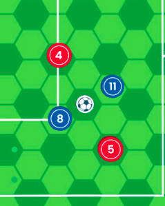

[Read this page in English](https://counterattackgame.github.io/wiki/passing) - [Lire cette page en Français](https://counterattackgame.github.io/wiki/fr/passing) - [Leggi questa pagina in Italiano](https://counterattackgame.github.io/wiki/it/passing) - [Lê esta página em Português](https://counterattackgame.github.io/wiki/pt/passing) - [Διαβάστε αυτή τη σελίδα στα Ελληνικά](https://counterattackgame.github.io/wiki/gr/passing)

[Ritorna all'Home Page](https://counterattackgame.github.io/wiki/it/index)
# Passing

Ci sono 3 tipi di passaggio nelle Regole di Base e 4 nelle Regole Avanzate.

Lo stick per la distanza mostra quanto distante può andare al massimo ogni passaggio. C'è una lunghezza massima per ogni tipo di passaggio, ma non è obbligatorio usarla nella sua interezza.

Posizionare lo stick sopra il giocatore che effettua il passaggio e puntarlo nella direzione verso la quale si vuole effettuare il passaggio.

## Standard Pass

Uno Standard Pass viaggia sul terreno. Il pallone non può passare attraverso un avversario (vedere Zone of Influence), ma può passare attraverso un compagni di squadra.

Se la traiettoria del pallone passa in un esagono adiacente a un difensore, questo può lanciare un 6 oppure il risultato combinato di dado + Tackling deve essere 10+ per poter intercettare il passaggio.

Se l'intercetto ha successo, il possesso di palla cambia. Continuare con Any Other Scenario (Movement, First Time Pass, Long Pass, Snapshot). Il difensore prende il pallone nel suo esagono e non va verso la palla o comunque non si riposiziona.

Il giocatore che effettua uno Standard Pass può riprendere il pallone se vuole.

## High Pass

Usare lo stick per la distanza per vedere la massima distanza di un High Pass. Se un avversario è in un esagono adiacente a colui che effettua l'High Pass e sulla traiettoria del pallone, il passaggio non può essere effettuato. Posizionare la palla dove si vuole che vada. Il pallone deve essere posizionato sulla [testa](https://counterattackgame.github.io/wiki/it/heading) di uno dei propri giocatori.

Successivamente, ogni squadra può muovere un giocatore fino a 3 esagoni mentre la palla è in aria. Questo vuol dire che la posizione di fuorigioco di ogni giocatore deve essere verificata prima di questi due movimenti.

Se un High Pass è giocato nell'area di rigore, inoltre, il portiere può muoversi di un esagono.

A questo punto verificare la precisione: attributo High Pass del giocatore che effettua l'High Pass + dado deve essere di 8+. Se il passaggio è impreciso, seguire le istruzioni di High Pass Impreciso qui sotto.

Un High Pass deve andare almeno a 3 esagoni di distanza dal giocatore che lo effettua, ma anche in caso di un passaggio impreciso il giocatore che calcia non può [colpire di testa](https://counterattackgame.github.io/wiki/it/heading) il proprio High Pass. Se un High Pass impreciso finisce sul passatore, continuare con Any Other Scenario.

### High Pass imprecisi

Se un High Pass è impreciso, seguire le istruzioni di [Loose Ball](https://counterattackgame.github.io/wiki/it/loose_ball) per vedere l'effettiva destinazione del passaggio alto. Il risultato potrebbe far uscire il pallone dal campo per un Goal Kick (Rimessa da Fondo Campo) oppure una Throw-In (Rimessa Laterale).

In caso di High Pass impreciso, la traiettoria è considerata come una linea dritta tra il passatore e la destinazione finale.

Un High Pass impreciso non può essere intercettato.

Una volta che la destinazione finale del pallone è stata determinata, se ci sono giocatori entro 2 esagoni di distanza, un [Header](https://counterattackgame.github.io/wiki/it/heading) o un Control devono essere effettuati da almeno un giocatore. Se non ci sono giocatori sufficientemente vicini, continuare il gioco con una [Movement Phase](https://counterattackgame.github.io/wiki/it/movement_phase).

### Tentativo di Control del Pallone

Se nessun avversario è sufficiente vicino per fare un [Header](https://counterattackgame.github.io/wiki/it/heading), l'allenatore in attacco può decidere se (a) effettuare un colpo di testa incontrastato oppure (b) controllare la palla. Per la seconda opzione, lanciare il dado e controllare che il risultato combinato di dado + Dribbling sia 9+:

- Se il controllo ha successo, continuare come se il giocatore avesse vinto un tackle.
- Se il controllo non ha successo, seguire con le istruzioni di [Loose Ball](https://counterattackgame.github.io/wiki/it/loose_ball).
- Se nessun giocatore può contendere un High Pass impreciso, continuare il gioco con una [Movement Phase](https://counterattackgame.github.io/wiki/it/movement_phase). La squadra in attacco muove per prima.

## Long Pass

Un Long Pass può andare in qualsiasi posizione sul terreno di gioco. Non c’è bisogno dello stick per la distanza (o di un numero massimo di esagoni). Tuttavia ci sono delle limitazioni:

- Non si può effettuare un Long Pass da un Final Third all'altro (con le Regole Avanzare si può) o fare il passaggio se c’è un avversario in un esagono adiacente al passatore e nella direzione della traiettoria del pallone.

- Il pallone non può essere posizionato entro 5 esagoni di distanza da un compagno di squadra e in qualsiasi esagono adiacente a un avversario.

Non c’è nessuna regola contro il fatto che il passatore di un Long Pass possa recuperare il eventualmente il pallone.

### Controllo della Precisione

Si deve sempre controllare la precisione quando si gioca un Long Pass. Un risultato combinato (dado + attributo di High Pass) di 9+ è necessario per far sì che il Long Pass sia preciso.

Con le Regole Avanzate, un Long Pass da un Final Third all'altro è possibile, ma richiede un risultato combinato di 10+ per essere preciso.

Se il passaggio dovesse essere impreciso, seguire le istruzioni di [Loose Ball](https://counterattackgame.github.io/wiki/it/loose_ball) come in High Pass.

Preciso o no, il Long Pass viaggia in aria e non può essere intercettato nel suo tragitto. Tuttavia, un Long Pass impreciso potrebbe cadere direttamente su un avversario. In ogni caso, non si verifica un colpo di testa dopo un Long Pass.

### Cosa accade dopo un Long Pass?

Dopo un Long Pass l'allenatore in difesa può muovere il portiere rispetto al suo attributo di Pace.

Nel caso in cui il pallone finisse nell'area di rigore, il portiere avrebbe un movimento aggiuntivo di 1 esagono.

Il gioco continua con una [Movement Phase](https://counterattackgame.github.io/wiki/it/movement_phase) con la squadra in attacco che muove per prima.

## First Time Pass

Il First-time Pass è un passaggio corto. Può essere utilizzato per prendere di sorpresa una difesa stretta, ma bisogna fare attenzione perché un difensore può muoversi di un esagono per intercettare il pallone.

Decidere in quale esagono il pallone deve andare e muovere un giocatore di 1 esagono per squadra mentre la palla sta viaggiando. La squadra in attacco muove per prima.

- Se il difensore si muove nella traiettoria del pallone, può intercettare il passaggio lanciando un 5, un 6 oppure la somma di dado + Tackling deve essere maggiore di 10.
- Se il difensore si muove a un esagono adiacente alla traiettoria del pallone, può intercettare il passaggio lanciando un 6 oppure la somma di dado + Tackling deve essere maggiore di 10.
- Se il difensore si muove in un esagono adiacente al giocatore che effettua il passaggio, può intercettare il passaggio lanciando un 6 oppure la somma di dado + Tackling deve essere maggiore di 10. Lanciando un 1 commetterebbe fallo.

Notare che il ricevitore del passaggio deve essere differente dal passatore.

Notare anche che se il sesto esagono del First Time Pass è quello di un compagno di squadra e l'attaccante decide di passare la palla a quel giocatore quel giocatore muovendolo inoltre di un esagono ulteriore, questo non potrà portare con se il pallone. La distanza massima del First Time Pass deve essere infatti rispettata.

# Esempi Grafici

## Standard Pass

Il giocatore in possesso di palla è il Red 4 (R4).

- Un passaggio a R5 non può essere effettuato perché la passa passerebbe direttamente nell'esagono di White 7 (W7).
- Un passaggio a R10 può essere effettuato, ma W7 potrebbe lanciare il dado per intercettarlo perché il pallone passa nella sua ZOI.
- Un passaggio a R7 può essere effettuato e nessuno può intercettarlo. La palla entra nella ZOI di W5, ma l'esagono è occupato da R7, dunque l'intercetto non è possibile.

Inoltre:

- Se questo fosse un tentativo di Standard Pass tra i giocatori Rossi, entrambi i Blu potrebbero provare a intercettare il passaggio.
- Se questo fosse un tentativo di Standard Pass tra i giocatori Blue, NESSUNO dei Rossi potrebbe provare a intercettare il passaggio.

- R2 (con il pallone) effettua un uno standard pass a R3, R8, (ovunque sulla diagonale) fino a R11 e nessun intercetto è possibile per nessuno dei difensori gialli.
- La logica è che un attaccante che occupa un esagono è più forte di un difensore che applica la sua ZOI (nel caso di Yellow 3)
- I tre difensori gialli dietro R11 sono posizionati in modo da dimostrare che se il pallone viene direttamente dalla diagonale che connette i giocatori rossi, tutti e tre sono considerati essere alle spalle di R11 e dunque non possono intercettare il passaggio.
- Tutto il discorso non cambia in caso di passaggio di prima, se consideriamo che l'immagine mostra la situazione dopo che entrambi gli allenatori hanno effettuato il loro movimento di 1 esagono

## High Pass

Red 4 (R4) ha la palla.

- Un High Pass in direzione di R7 non può essere effettuato perché White 7 (W7) è in un esagono adiacente a R4 e nella traiettoria del pallone.
- Un High Pass in direzione di R10 può essere fatto perché nessun avversario è nell'esagono adiacente a R4 e nella traiettoria del pallone.

## Long Pass

Le regole per bloccare un Long Pass sono le stesse di quelle per bloccare un High Pass.

## First Time Pass

Red 4 (R4) ha la palla.

Un First Time Pass viene provato nella direzione della freccia lunga.

Mentre la palla sta viaggiando, R10 si muove di un esagono in alto per ricevere il passaggio e W7 si muove di un esagono a sinistra per provare a intercettarlo.

Visto che W7 si muove nella traiettoria del pallone, W7 può intercettarlo lanciando un 5 o un 6 o con un risultato combinato di 10+ (Tackling).

Se W7 non dovesse riuscirci, R10 riceve il pallone nell; esagono in cui si è mosso. W5 non può intercettare il passaggio perché R10 sta occupando l'esagono dove è finito il pallone.

[Ritorna all'Home Page](https://counterattackgame.github.io/wiki/it/index)