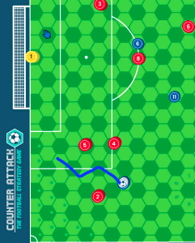

[Back to Home Page](https://counterattackgame.github.io/wiki)
# Movement Phase

A Movement Phase represents a split second on the football pitch. The attacking manager can start a Movement Phase after every action except a high pass. One Movement Phase can follow another if the attacking manager wishes.

Each player’s Pace attribute determines how far they can travel in a Movement Phase e.g. a player with pace of 6 can move up to a total of 6 hexes during a Movement Phase. Players cannot move through teammates or opposition players.

During a Movement Phase, follow the 4-5-2 sequence:

1. Attacking manager moves 4 players (Can include the GK)
2. Defending manager moves 5 players (Can include the GK)
3. Attacking manager moves 2 new players, up to a maximum of 2 hexes each (Can include the GK)

During the Movement Phase, if the player in possession of the ball moves the ball within 1 hex of an opponent, the defender MUST try to steal the ball.
All they have to do is roll a 6 OR achieve a combined score of 10+ (Tackling + dice roll)
If the defender succeeds, the Attacker does not exceed his pace and play continues with Any other Scenario
If the defender fails, the attacker can continue moving through the defender’s Zone of Influence, but no more ‘steal’ attempts are made by that defender.

Remember that a **roll of 1 when attempting a steal** is a foul, so refer to the Fouls section for more info.

**Actions during the Movement Phase**

- You cannot make a [pass](https://counterattackgame.github.io/wiki/passing) until the Movement Phase has ended. However, you can take a [Shoot](https://counterattackgame.github.io/wiki/shooting) during a Movement Phase if your player has the ball in the box.
- If a defender moves a player within 1 hex of the attacker in possession, a tackle can be attempted. Pause the sand timer while making the tackle.
- If a player is successfully tackled during the Movement Phase, possession of the ball changes hands and the current Movement Phase immediately comes to an end.

## Tackling vs Dribbling

Tackling is a duel between the defender and the attacker. A tackle can be attempted if a defender moves within 1 hex of the player with the ball during a Movement Phase

In the event of a tie, follow the [Loose Ball](https://counterattackgame.github.io/wiki/loose_ball) instructions. (if ball hits defender or no-one: Any other scenario. 
- If the ball hits an attacker, continue the current movement)
- If the defender rolls a 1, the attacker can play on or claim a foul.
- If the attacker’s score is higher, the tackle was unsuccessful. The attacking player may now be repositioned in any hex surrounding the defender.
- If the defender’s score is higher, the tackle was successful and ball possession changes. The defender’s manager may reposition their player into any hex surrounding the player they just tackled. The Movement Phase comes to an end and play resumes.

## Foul

If your opponent rolls a 1 when making a tackle or a steal then a foul has been committed. Roll the dice to check for an injury (see below). You now have two choices: take the free kick/penalty or continue play.

Even if you choose to continue play, you still have to roll the dice to determine whether your player has been injured, and your opponent still has to roll the dice to check if the defender is booked. If you decide to stop play for a free kick/penalty, refer to Set Pieces.

## To check for an injury

Roll a dice. If the dice roll is equal to or higher than your player’s Resilience attribute then they are injured. Place an injury token on that player’s card.

An injured player’s attributes are ALL reduced by 1 for the remainder of the match. You can always substitute the player if you wish when play stops (an excellent opportunity for that is to take the foul instead of playing on.)

Injuries have **immediate** effect. This means that if you spend 1 Pace, and get in a Defender's ZOI, he rolls for a steal and fouls, if you pick up an injury, and decide to play on, you now have one pace less to run as you are already injured.

A player that is injured for the second time in the same match, must be substituted, so the attackers must stop play to take the free kick and take the injured player out.

## To check for a booking

Roll a dice. If the dice roll is equal to or higher than the referee’s Leniency attribute, the player who made the foul receives a yellow card. Any player who receives a second yellow card is then shown a red card and has to leave the pitch immediately. Play must stop for a free kick or penalty if a player receives a red card.

## Tackles from Behind

If a defender attempts a tackle from behind, a dice roll of 1 or 2 is considered to be a foul. A tackle is considered from behind if it is attempted on either of the two hexes that a reposition of the attacker does not bring him closer to the Goal.

A tackle from behind is considered dangerous so the player who makes it runs the risk of receiving a straight red card! If the foul has been committed, run a leniency check with the referee.

- If you pass you will be shown a yellow card.
- If you fail you will be given a red card.

## Professional (Last Man) Fouls

If your opponent has fouled you and stopped a clear goalscoring opportunity, then they could be shown a straight red card!

If no other defender can get in line with/past the tackle hex in the same movement phase then the defender attempting the tackle is considered a last man.

Roll a dice. If the dice roll is equal to or higher than the referee’s Leniency attribute, then your player receives a straight red card. Otherwise your player receives a yellow card.

## Reckless Tackle

Sometimes you just want to foul your opponent! If you want to try this, you must say ‘RECKLESS TACKLE’ before rolling the dice. In this scenario, only the defender rolls the dice.

- If you roll a 1 or 2, the reckless foul fails and the attacker avoids your challenge. Play continues, but your defender is given a yellow card for attempting a reckless tackle.
- If you roll a 3 or higher, the attacker is cynically fouled. Run a leniency check with the referee. If you pass you will be shown a yellow card. If you fail you will be given a red card.

You can only make a reckless tackle on a player maximum 3 hexes of the ball.

## Nutmeg a defender

When you have the ball and want to take on a defender you can attempt to nutmeg them.

This is a difficult move to execute but it’s worth it if you manage it! Here’s how it’s done:

1. Approach a defender during a movement phase.
2. Make sure you have enough pace to travel through the defender.
3. You and the defender run through the usual test for a tackle.
4. The defender’s tackling attribute is increased by 1 in this challenge.
5. The defender MUST challenge

### What happens if the nutmeg is successful:

- The attacker moves to any hex on the other side of the defender. The defender is **stunned** and cannot move during the Movement Phase. 
- The attacker can move to one of the three hexes on the other side of the defender, and continue his move if he has any Pace remaining.

### What happens if the nutmeg is unsuccessful:

The defender wins the tackle and play continues in the usual manner, by repositioning around the attacker, who does not go through the defender.

If it’s a tie, refer to the Loose Ball instructions, but the attacker who initiated nutmeg cannot move - regardless of how much pace he has already used.

# Extra Notes
- Defender does not get to choose whether to Steal during the attacker's dribble, they DO have to roll, with the risk of unintentionally fouling.
- Same goes with the Nutmeg, the defender cannot just accept that it was successful, and its consequences, instead of taking part in a duel.
- Defending a steal or a nutmeg is NOT a choice. You have to defend.
- The attacker must call the attempt for a nutmeg when approaching the defender, so that the targeted defender does not get a steal attempt. Other closeby defenders get their chance for a steal, including the defenders whose ZOI the attacker lands after the successful nutmeg.
- When attempting a nutmeg you are using 2 Pace which needs to be available (one for the Defender's Hex and one for the Hex around them)
- A player or the ball can be placed on any hex visible (fully or partly) on the pitch. All those hexes are considered WITHIN bounds, so in order to have a throw-in, goal-kick and of course a goal, the ball has to move to a theoretical (non visible) adjacent hex towards the outer side of the board.
- When picking up a ball that was loose, the movement ends immediately and resume with any other scenario. If you pick it up with the Goalkeeper within the penalty box using your hands, and continue play as if you Saved and Held a shot.
- As soon as the attacker steps into the box with the ball, the GK has to move the allowed 1 hex. The attacker then continues their move, if pace allows.
- If an attacker with the ball enters, leaves and reenters the penalty box in one Movement Phase, the GK gets a free move every time that attacker enters the box.
- When trying to collect an unclaimed ball, there is a ZOI of defenders. If the ball is not in possession, if a defender goes within one Hex to it (even the Goalkeeper), he can roll as if he was trying a steal.
- This can only be done by the defence, and if successful, player attracts the ball, Movement Phase ends immediately and play continues as a successful steal: “Any other Scenario”

# Graphical Examples

## Movement Phase

Blue is in Possession and thus the "attacking team".
They attempt these 4 moves, B10 is acting risky there, by going into the R8 ZOI (twice, but R8 gets only once chance for a a steal, which let's say he fails), and then R4.
If R4 rolls a 6 (or a 10+ Tackling) the ball is stolen, Movement Phase comes to an end as possession (and thus "attacking team") change. R4 does not reposition ,And Play continues with "Any Other Scenario"
If R4 rolls a 1, then a fouls is committed, Leniency and Resiliece tests are forced, and then Blue decide if they want to take the Free Kick or not. (See Set Pieces Section for more info on that)
Let's assume that R4 rolled a 3, so nothing happens.

## Defensive Movement Phase starts.
R4 tackles from where he stands, as he touches B10, but that is counted as a move for Red.
If Blue keeps possession after an unsuccessful tackle, B10 can reposition anywher around R4.
In case B10 ends within the Penalty Box after a reposition, the GK gets a free move of 1 Hex, but Blue cannot Snapshot, as it is thechnically in the Defensive Part of the Movement (blue is not dribbling into the box).

## Nutmeg during a Movement Phase

Blue is in Possession with 10, who has a Pace of 5 and Dribbling of 6. He is also Brazilian and decides to go for glory.
He has enough pace to attempt a nutmeg to R2, calls the nutmeg, wins the duel despite R2 got a tackling bonus of +1.
B10 is fully determined as the crowd is cheering. He calls annother nutmeg on R5, as he was just enough Pace to reach the other side of him. For the sake of the example he wins the duel fair and square, and calls a snapshot. But B10 rolls a 1 so shoots over the bar...but it was a world class move!

### Two points to consider here:
- Winning a Nutmeg practically allows a reposition, but it consumes 2 Paces whatsoever.
- If B10 had a Pace of 4, he could not have attempted the nutmeg on R5.

### Dribbling in and out of the Penalty Box

B10 wants to play it safe and avoid all possible steal attempts, so he follows the below path. He essentially enters the box twice, (in the two dark Hexes) so he should have stopped his movement twice to ask the keeper if they wanted to move their free Hex of 1.

